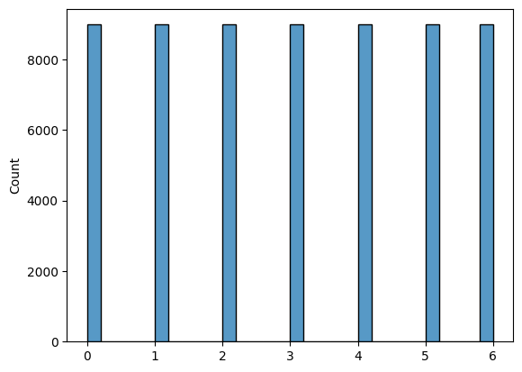
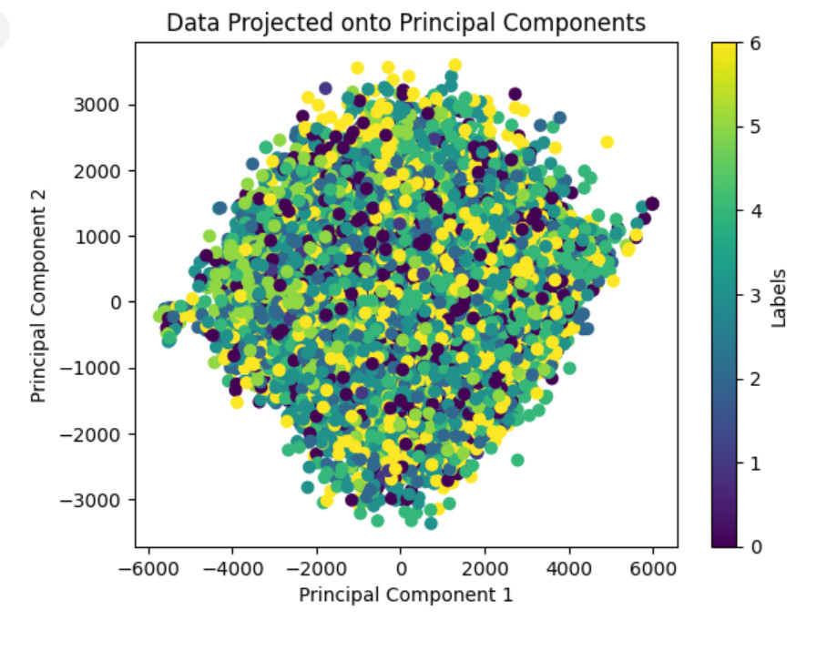

# Mini-Project for Fundamentals of Machine Learning Course

This repository contains the code and data for a mini-project on facial expression recognition using machine learning algorithms.

## 📑 Project Policy
- Team: group should consist of 3-4 students.

    |No.| Student Name    | Student ID |
    | --------| -------- | ------- |
    |1|Lê Thị Mỹ Tiên| 20280096
    |2|Trần Hoàng Anh| 20280004
    |3|Phạm Quốc Thiện| 20280090
    |4|Trần Văn Hữu Lượng| 21280030

- The submission deadline is strict: **11:59 PM** on **June 22nd, 2024**. Commits pushed after this deadline will not be considered.

## 📦 Project Structure

The repository is organized into the following directories:

- **/data**: This directory contains the facial expression dataset. You'll need to download the dataset and place it here before running the notebooks. (Download link provided below)
- **/notebooks**: This directory contains the Jupyter notebook ```EDA.ipynb```. This notebook guides you through exploratory data analysis (EDA) and classification tasks.

## ⚙️ Usage

This project is designed to be completed in the following steps:

1. **Fork the Project**: Click on the ```Fork``` button on the top right corner of this repository, this will create a copy of the repository in your own GitHub account. Complete the table at the top by entering your team member names.

2. **Download the Dataset**: Download the facial expression dataset from the following [link](https://mega.nz/file/foM2wDaa#GPGyspdUB2WV-fATL-ZvYj3i4FqgbVKyct413gxg3rE) and place it in the **/data** directory:

3. **Complete the Tasks**: Open the ```notebooks/EDA.ipynb``` notebook in your Jupyter Notebook environment. The notebook is designed to guide you through various tasks, including:
    
    1. Prerequisite
    2. Principle Component Analysis
       
       We realize imbalance data when plot -> So we use oversampling method to solve problem
       
       
    3. Image Classification
       
    4. Evaluating Classification Performance

    |No.| Model name    | Accuracy | Precision | Recall | F1-score
    | --------| -------- | ------- | -------- | ------- | ------- |
    |1|Decision Tree| 0.77 | 0.79 | 0.78 | 0.78 |
    |2|Random Forest| 0.77 |  0.78 | 0.78 | 0.78 
    |3|XGBOOST| 0.73 | 0.73 | 0.72 | 0.72 
    |4|MLP | 0.75 |  0.75 | 0.75 | 0.75 


